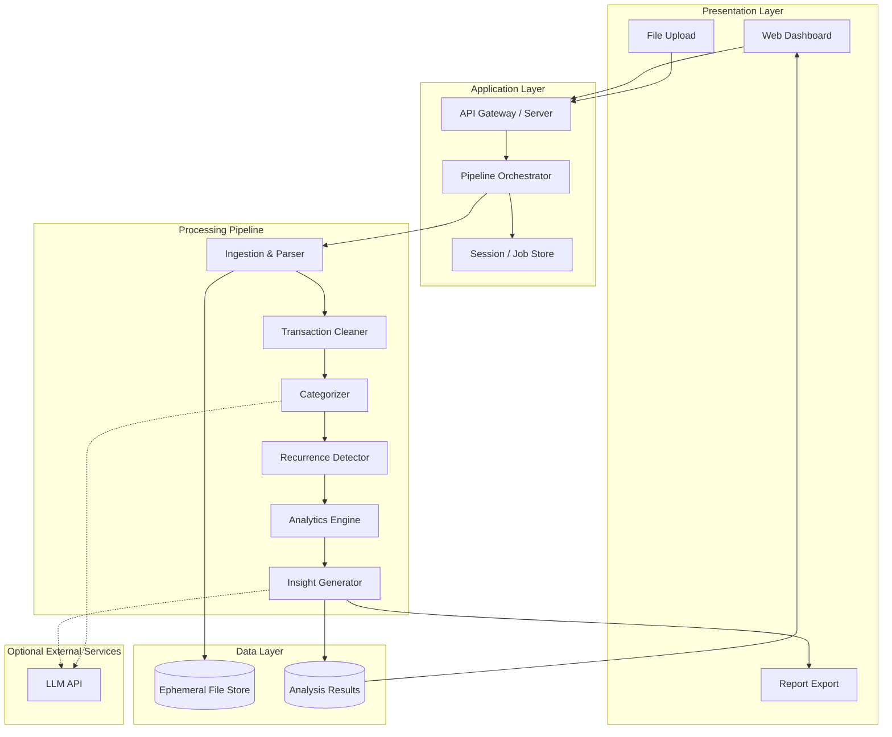
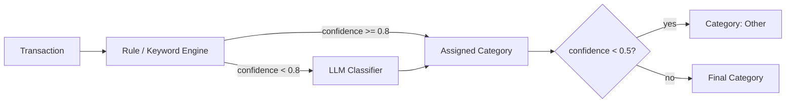
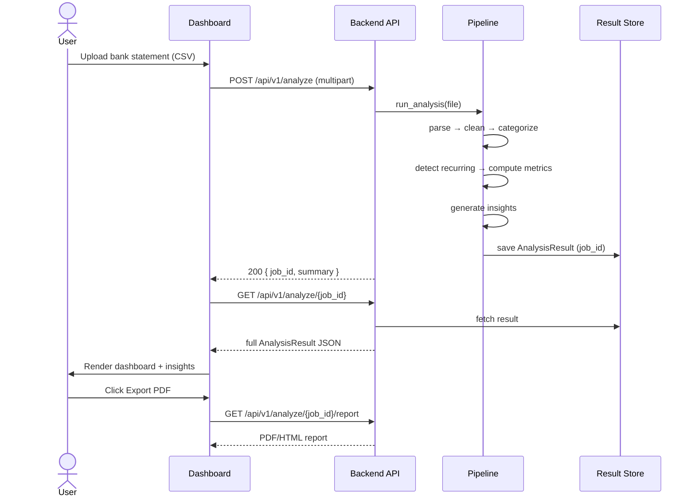
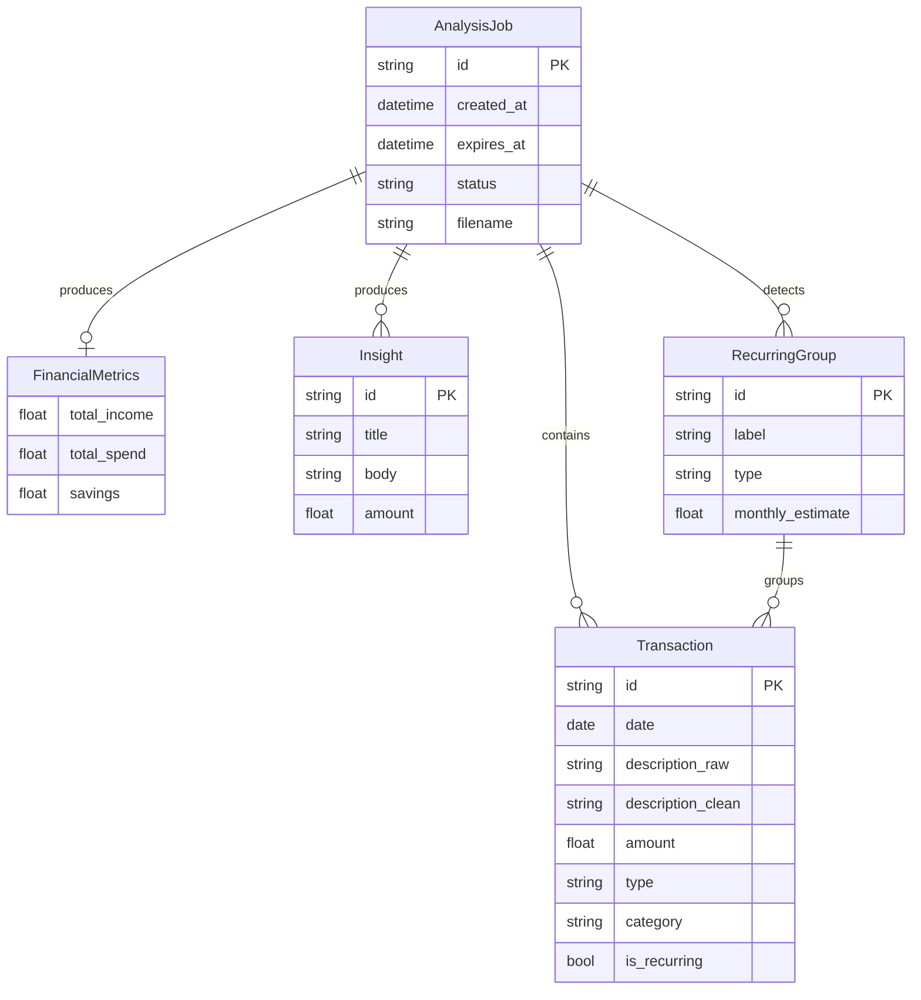
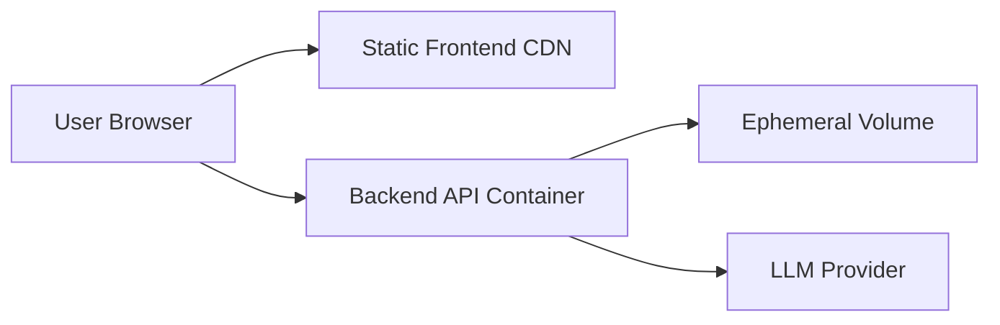

# RupeeRadar — System Architecture

This document describes the technical architecture for RupeeRadar, an AI-powered personal finance assistant that transforms raw bank statement data into categorized transactions, recurring-payment detection, financial metrics, and human-readable insights.

It is derived from [context.md](./context.md) and is intended to guide implementation of a working end-to-end prototype.

---

## 1. Architecture Goals

| Goal | Rationale |
|------|-----------|
| **End-to-end completeness** | Upload → process → dashboard → report must work as a single flow |
| **Messy-data robustness** | Real Indian bank/UPI descriptions are inconsistent; pipeline must tolerate noise |
| **Privacy by default** | Bank statements are sensitive; minimize retention and external exposure |
| **Modular pipeline** | Each stage (parse, clean, categorize, detect, analyze) is independently testable |
| **Prototype speed** | Prefer one bank/CSV format first; abstract later for multi-bank support |
| **Explainable output** | Every insight must trace back to actual transaction amounts |

---

## 2. High-Level Architecture

RupeeRadar follows a **layered pipeline architecture** with a thin presentation layer, an orchestration API, and a sequential data-processing pipeline.



### Architecture style

- **Monolith-first** for the prototype: single backend service + single frontend app.
- **Pipeline stages** are pure functions or service modules invoked synchronously for small files; async job queue optional for large PDFs.
- **Stateless processing** where possible: each analysis run is keyed by a session/job ID.

---

## 3. Recommended Technology Stack

Stack is open per project constraints. Recommended default for fast delivery:

| Layer | Recommended | Alternatives |
|-------|-------------|--------------|
| Frontend | React + Vite + Tailwind + Recharts | Next.js, Streamlit (rapid demo) |
| Backend | Python FastAPI | Node.js Express, Flask |
| Parsing | `pandas`, `pdfplumber` / `tabula-py` | `camelot`, bank-specific parsers |
| Categorization | Rule engine + keyword map + LLM fallback | scikit-learn classifier, embeddings |
| Insights | Template engine + LLM (structured prompts) | Pure template (no LLM) |
| Storage | In-memory / SQLite for prototype | PostgreSQL, Redis |
| Report export | HTML → PDF (`weasyprint`) or client-side PDF | CSV/JSON download |
| Deployment | Docker Compose (local) + Render/Railway/Fly.io | Vercel (frontend) + API host |

---

## 4. Component Design

### 4.1 Presentation Layer (UI / Dashboard)

**Responsibility:** File upload, progress feedback, visualization, transaction review, report download.

#### Pages / views

| View | Purpose |
|------|---------|
| **Upload** | Drag-and-drop bank statement (CSV/PDF/Excel); show format hints |
| **Processing** | Progress indicator while pipeline runs |
| **Dashboard** | Summary cards, category breakdown chart, monthly trend |
| **Transactions** | Searchable/filterable table with raw vs cleaned description, category, recurring flag |
| **Recurring** | List of detected subscriptions, EMIs, rent, SIPs |
| **Insights** | At least 3 narrative insight cards with supporting numbers |
| **Report** | Printable/shareable summary (PDF or styled HTML) |

#### Key UI widgets

```
┌─────────────────────────────────────────────────────────────┐
│  RupeeRadar                                    [Export PDF] │
├─────────────────────────────────────────────────────────────┤
│  Total Income    Total Spend    Savings    Transactions     │
│  ₹1,25,000       ₹98,400        ₹26,600    247              │
├──────────────────────────┬──────────────────────────────────┤
│  Spending by Category    │  Top Insights                    │
│  [Donut / Bar Chart]     │  • Food delivery up 23% MoM      │
│                          │  • Netflix + Spotify = ₹998/mo   │
│                          │  • Largest txn: ₹45,000 rent     │
├──────────────────────────┴──────────────────────────────────┤
│  Transactions │ Recurring │ Insights                        │
│  [Filterable table]                                         │
└─────────────────────────────────────────────────────────────┘
```

#### Frontend modules

```
frontend/
├── components/
│   ├── UploadZone.tsx
│   ├── SummaryCards.tsx
│   ├── CategoryChart.tsx
│   ├── TransactionTable.tsx
│   ├── RecurringList.tsx
│   ├── InsightCards.tsx
│   └── ReportView.tsx
├── hooks/
│   └── useAnalysis.ts
├── api/
│   └── client.ts
└── types/
    └── finance.ts          # Shared types mirroring backend schemas
```

---

### 4.2 API Gateway & Orchestrator

**Responsibility:** Accept uploads, validate input, run the pipeline, return structured results.

#### Core endpoints

| Method | Path | Description |
|--------|------|-------------|
| `POST` | `/api/v1/analyze` | Upload statement file; returns `job_id` or full result (sync) |
| `GET` | `/api/v1/analyze/{job_id}` | Poll job status and retrieve results |
| `GET` | `/api/v1/analyze/{job_id}/transactions` | Paginated transaction list |
| `GET` | `/api/v1/analyze/{job_id}/report` | Download PDF/HTML report |
| `DELETE` | `/api/v1/analyze/{job_id}` | Purge session data (privacy) |
| `GET` | `/api/v1/health` | Health check |

#### Orchestrator flow

```python
def run_analysis(file: UploadFile, options: AnalyzeOptions) -> AnalysisResult:
    raw_rows = ingestion.parse(file)
    transactions = cleaner.clean(raw_rows)
    transactions = categorizer.categorize(transactions)
    recurring = recurrence_detector.detect(transactions)
    transactions = merge_recurring_flags(transactions, recurring)
    metrics = analytics.compute(transactions)
    insights = insight_generator.generate(transactions, metrics, recurring)
    return AnalysisResult(
        transactions=transactions,
        recurring=recurring,
        metrics=metrics,
        insights=insights,
    )
```

#### Error handling strategy

| Stage | Failure mode | User-facing behavior |
|-------|--------------|----------------------|
| Upload | Invalid file type | 400 with supported formats list |
| Parse | Unrecognized layout | 422 with "try CSV export from bank" message |
| Parse | Empty file | 422 "no transactions found" |
| Categorize | LLM timeout | Fall back to rule-based only |
| Any | Unexpected error | 500 generic message; no raw statement in logs |

---

### 4.3 Ingestion & Parser

**Responsibility:** Read uploaded files and emit raw row objects.

#### Supported formats (phased)

| Phase | Format | Approach |
|-------|--------|----------|
| **P0 (prototype)** | CSV | Column mapping + header detection |
| **P1** | Excel (`.xlsx`) | `openpyxl` / `pandas.read_excel` |
| **P2** | PDF | `pdfplumber` table extraction; bank-specific templates optional |

#### Parser interface

```python
class StatementParser(Protocol):
    def can_parse(self, file: UploadFile) -> bool: ...
    def parse(self, file: UploadFile) -> list[RawTransaction]: ...
```

#### Raw transaction schema

```python
@dataclass
class RawTransaction:
    date: str | None
    description: str
    debit: float | None
    credit: float | None
    balance: float | None
    reference: str | None
    source_row: int
```

#### CSV column mapping

Prototype supports configurable mapping for common Indian bank exports:

```json
{
  "date_column": "Transaction Date",
  "description_column": "Narration",
  "debit_column": "Withdrawal Amt.",
  "credit_column": "Deposit Amt.",
  "date_format": "%d/%m/%Y"
}
```

Auto-detect headers by fuzzy matching keywords: `date`, `narration`, `description`, `debit`, `credit`, `withdrawal`, `deposit`.

---

### 4.4 Transaction Cleaner

**Responsibility:** Normalize raw rows into canonical `Transaction` records.

#### Cleaning steps (ordered)

1. **Date normalization** — Parse multiple date formats → ISO `YYYY-MM-DD`
2. **Amount resolution** — Single signed `amount`; infer `type` (`debit` | `credit`)
3. **Description cleanup**
   - Strip extra whitespace, UPI refs (`UPI/`, `@paytm`, `/IMPS/`)
   - Remove repeated bank boilerplate
   - Extract merchant hint via regex/keyword (e.g., `SWIGGY`, `AMZN`, `NETFLIX`)
4. **Deduplication** — Hash `(date, amount, description_normalized)`; flag duplicates
5. **Validation** — Drop rows with zero amount or unparseable date (log count)

#### Cleaned transaction schema

```python
@dataclass
class Transaction:
    id: str                          # UUID
    date: date
    description_raw: str
    description_clean: str
    amount: float                    # Always positive
    type: Literal["debit", "credit"]
    merchant: str | None
    category: Category | None        # Set by categorizer
    category_confidence: float       # 0.0 – 1.0
    is_recurring: bool
    recurring_group_id: str | None
    metadata: dict                   # UPI ref, source row, etc.
```

---

### 4.5 Categorizer

**Responsibility:** Assign each transaction to one of the target categories.

#### Target categories

`Food | Travel | Shopping | Bills | EMI | Subscriptions | Salary | Rent | Investments | Other`

#### Hybrid categorization strategy (recommended)



**Layer 1 — Rule engine (fast, explainable)**

- Keyword/merchant dictionary mapped to categories
- Regex patterns for UPI handles, known merchants
- Credit-side rules: `SALARY`, `NEFT CREDIT`, employer names → `Salary`
- Amount heuristics: fixed round amounts monthly → candidate for `Rent` / `EMI`

Example rule table:

| Pattern | Category |
|---------|----------|
| `swiggy`, `zomato`, `eatfit` | Food |
| `uber`, `ola`, `irctc`, `makemytrip` | Travel |
| `amazon`, `flipkart`, `myntra` | Shopping |
| `netflix`, `spotify`, `youtube` | Subscriptions |
| `sip`, `groww`, `zerodha`, `mf` | Investments |

**Layer 2 — LLM fallback**

- Batch uncategorized / low-confidence transactions (max 50 per call)
- Structured output: `{ "id": "...", "category": "Food", "confidence": 0.85 }`
- Prompt includes category definitions and Indian merchant examples
- Never send full statement; send only `description_clean`, `amount`, `type`, `date`

**Layer 3 — User override (optional P1)**

- Allow manual recategorization in UI; persist overrides in session for demo

---

### 4.6 Recurrence Detector

**Responsibility:** Identify repeating debits/credits: subscriptions, EMIs, rent, SIPs, insurance.

#### Detection signals

| Signal | Weight | Example |
|--------|--------|---------|
| Same merchant + similar amount (±5%) | High | Netflix ₹649 monthly |
| Same amount on ~monthly interval | High | Rent ₹25,000 on 1st |
| Keyword in description | Medium | `EMI`, `SIP`, `INSURANCE` |
| Occurrence count ≥ 2 in period | Required | At least 2 instances |

#### Algorithm (prototype)

```python
def detect_recurring(transactions: list[Transaction]) -> list[RecurringGroup]:
    # 1. Group debits by normalized merchant (or amount bucket if merchant unknown)
    # 2. For each group with >= 2 transactions:
    #    - Check interval regularity (median days between ≈ 28–31 for monthly)
    #    - Check amount variance (stdev / mean < 0.05)
    # 3. Classify group type by category + keywords
    # 4. Emit RecurringGroup with monthly_estimate
```

#### Recurring group schema

```python
@dataclass
class RecurringGroup:
    id: str
    label: str                       # e.g. "Netflix Subscription"
    category: Category
    type: Literal["subscription", "emi", "rent", "sip", "insurance", "other"]
    amount: float                    # Typical amount
    frequency: Literal["weekly", "monthly", "quarterly", "yearly"]
    monthly_estimate: float
    transaction_ids: list[str]
    next_expected_date: date | None
```

---

### 4.7 Analytics Engine

**Responsibility:** Compute aggregate financial metrics from categorized transactions.

#### Metrics computed

| Metric | Calculation |
|--------|-------------|
| `total_income` | Sum of credit transactions (exclude internal transfers if detected) |
| `total_spend` | Sum of debit transactions |
| `savings` | `total_income - total_spend` |
| `savings_rate` | `savings / total_income` (if income > 0) |
| `transaction_count` | Total transactions |
| `by_category` | Debit sums grouped by category |
| `top_categories` | Top N categories by spend |
| `biggest_transaction` | Max debit by amount |
| `biggest_credit` | Max credit by amount |
| `monthly_spend` | Debits grouped by `YYYY-MM` |
| `recurring_monthly_total` | Sum of `RecurringGroup.monthly_estimate` |

#### Analytics output schema

```python
@dataclass
class FinancialMetrics:
    period_start: date
    period_end: date
    total_income: float
    total_spend: float
    savings: float
    savings_rate: float | None
    transaction_count: int
    by_category: dict[str, float]
    top_categories: list[CategorySummary]
    biggest_debit: TransactionSummary | None
    biggest_credit: TransactionSummary | None
    monthly_spend: list[MonthlySpend]
    recurring_monthly_total: float
```

---

### 4.8 Insight Generator

**Responsibility:** Produce ≥ 3 personalized, human-readable insights grounded in computed metrics.

#### Two-tier approach

**Tier 1 — Deterministic insight templates (always available, no LLM required)**

Templates triggered by rules:

| Rule | Example insight |
|------|-----------------|
| Top category > 30% of spend | "Food is your largest expense at ₹18,200 (28% of total spend)." |
| Recurring total > 20% of spend | "Fixed recurring payments total ₹14,500/month across 6 merchants." |
| Biggest single debit | "Your largest transaction was ₹45,000 rent on 2025-03-01." |
| MoM category spike | "Shopping increased 35% compared to last month." |
| High subscription count | "You have 8 active subscriptions costing ₹2,400/month." |

**Tier 2 — LLM enrichment (optional)**

- Input: metrics JSON + top 20 transactions + recurring summary (no PII beyond descriptions)
- Output: 3–5 insight strings; validate each references a number from metrics
- Guardrail: reject insights that cite amounts not in source data

#### Insight schema

```python
@dataclass
class Insight:
    id: str
    title: str
    body: str
    category: str | None             # Related spend category
    amount: float | None             # Supporting figure
    severity: Literal["info", "warning", "positive"]
    source: Literal["template", "llm"]
```

---

### 4.9 Report Generator

**Responsibility:** Produce downloadable/shareable summary.

#### Report sections

1. Cover — period, generated date
2. Executive summary — income, spend, savings
3. Category breakdown — chart + table
4. Recurring payments — list with monthly total
5. Top insights — ≥ 3 cards
6. Largest transactions — top 5 debits
7. Full transaction appendix (optional, paginated)

#### Export formats

| Format | Use case |
|--------|----------|
| **HTML** | In-browser view + print-to-PDF |
| **PDF** | Shareable attachment |
| **JSON** | API consumers / debugging |

---

## 5. Data Flow (End-to-End)



---

## 6. Data Layer

### 6.1 Storage strategy (prototype)

| Data | Storage | Retention |
|------|---------|-----------|
| Uploaded raw file | Temp filesystem / object store | Delete after processing or on session TTL (e.g. 1 hour) |
| Analysis results | SQLite or in-memory dict | Session TTL; user can DELETE |
| Category rules | JSON config in repo | Permanent |
| LLM prompts | Versioned in repo | Permanent |

### 6.2 Core entity relationships



---

## 7. Security & Privacy Architecture

### 7.1 Principles

- **Data minimization** — Process only fields needed for analysis
- **Ephemeral by default** — No long-term storage of statements without explicit consent
- **No secrets in logs** — Never log full descriptions at INFO level in production
- **Transport security** — HTTPS in deployed environments
- **Local-first option** — Docker Compose runs entirely offline except optional LLM calls

### 7.2 LLM data handling

| Data sent to LLM | Data never sent |
|------------------|-----------------|
| Cleaned description (truncated) | Account numbers, IFSC, phone numbers |
| Amount, date, debit/credit | Full raw file |
| Category enum list | User name, address |

Pre-LLM sanitization: strip patterns matching `\d{10,}`, account-like numeric sequences.

### 7.3 Session lifecycle

```
Upload → Process → Display → [TTL expiry | User DELETE] → Purge all artifacts
```

---

## 8. Project Structure (Suggested)

```
RupeeRadar/
├── Docs/
│   ├── context.md
│   ├── architecture.md
│   └── problemStatement.txt
├── backend/
│   ├── app/
│   │   ├── main.py                 # FastAPI entry
│   │   ├── api/
│   │   │   └── routes/
│   │   │       └── analyze.py
│   │   ├── pipeline/
│   │   │   ├── orchestrator.py
│   │   │   ├── ingestion/
│   │   │   │   ├── csv_parser.py
│   │   │   │   └── pdf_parser.py
│   │   │   ├── cleaner.py
│   │   │   ├── categorizer/
│   │   │   │   ├── rules.py
│   │   │   │   └── llm_classifier.py
│   │   │   ├── recurrence.py
│   │   │   ├── analytics.py
│   │   │   └── insights.py
│   │   ├── models/
│   │   │   ├── transaction.py
│   │   │   └── analysis.py
│   │   ├── report/
│   │   │   └── generator.py
│   │   └── config/
│   │       ├── categories.json
│   │       └── merchant_rules.json
│   ├── tests/
│   ├── requirements.txt
│   └── Dockerfile
├── frontend/
│   ├── src/
│   ├── package.json
│   └── Dockerfile
├── sample_data/
│   └── sample_statement.csv
├── docker-compose.yml
└── README.md
```

---

## 9. Deployment Architecture

### 9.1 Local development

```yaml
# docker-compose.yml (conceptual)
services:
  backend:
    build: ./backend
    ports: ["8000:8000"]
    environment:
      - LLM_API_KEY=${LLM_API_KEY}
      - SESSION_TTL_MINUTES=60
  frontend:
    build: ./frontend
    ports: ["5173:5173"]
    environment:
      - VITE_API_URL=http://localhost:8000
```

### 9.2 Production (minimal)



- Frontend: Vercel / Netlify / Cloudflare Pages
- Backend: Railway / Render / Fly.io
- No persistent DB required for prototype; SQLite file or in-memory acceptable

---

## 10. Testing Strategy

| Layer | Test type | Focus |
|-------|-----------|-------|
| Parser | Unit | CSV column detection, date/amount parsing |
| Cleaner | Unit | UPI string normalization, deduplication |
| Categorizer | Unit + golden | Known merchants → expected category |
| Recurrence | Unit | Synthetic monthly patterns detected |
| Analytics | Unit | Metric calculations, edge cases (no income) |
| Insights | Snapshot | Template outputs match expected strings |
| API | Integration | Upload → full JSON response |
| E2E | Playwright/Cypress | Upload sample file → dashboard renders |

### Golden test files

Maintain `sample_data/` with anonymized real-world messy descriptions:

- `upi_food.csv` — Swiggy/Zomato variants
- `mixed_spend.csv` — Multi-category month
- `recurring_heavy.csv` — EMIs + subscriptions + rent

---

## 11. Performance & Scalability (Prototype Targets)

| Scenario | Target |
|----------|--------|
| CSV, ~500 transactions | < 3 seconds end-to-end (no LLM) |
| CSV + LLM fallback (~50 txns) | < 15 seconds |
| PDF statement | < 30 seconds |
| Concurrent users (demo) | 5–10 simultaneous uploads |

Optimizations deferred until needed: batch LLM calls, async job queue, caching category rules.

---

## 12. Failure Modes & Fallbacks

| Component | Fallback |
|-----------|----------|
| PDF parse fails | Prompt user to export CSV from net banking |
| LLM unavailable | Rule-only categorization + template-only insights |
| Unknown merchant | Category = `Other`, confidence = 0 |
| No credits in period | Hide savings rate; show spend-only insights |
| Duplicate transactions | Flag in UI; exclude from totals if user confirms |

---

## 13. Future Extensions (Post-Prototype)

- Multi-bank parser plugins (HDFC, ICICI, SBI templates)
- User accounts + encrypted persistent storage
- Budget targets and alerts
- Month-over-month comparison dashboard
- Embeddings-based merchant clustering
- On-device processing (no cloud LLM) for full privacy

---

## 14. Architecture Decision Records (Summary)

| Decision | Choice | Reason |
|----------|--------|--------|
| Architecture pattern | Modular monolith + pipeline | Fast to build; easy to demo |
| Primary input format | CSV first | Most reliable for prototype |
| Categorization | Rules first, LLM fallback | Explainable + handles edge cases |
| Insights | Templates + optional LLM | Works offline; meets ≥3 insight requirement |
| Storage | Ephemeral session store | Aligns with privacy requirements |
| Auth | None for v1 | Out of scope unless demo requires it |

---

## 15. Mapping to Success Criteria

From [context.md](./context.md):

| Success criterion | Architectural element |
|-------------------|----------------------|
| Cleaned transaction data | Cleaner module + Transactions UI table |
| Categorized expenses | Categorizer + category chart |
| Recurring payment detection | Recurrence detector + Recurring view |
| Spend summary dashboard | Analytics engine + Dashboard UI |
| ≥ 3 personalized insights | Insight generator (templates + LLM) |
| Shareable report | Report generator (PDF/HTML export) |
| Privacy-conscious handling | Ephemeral storage, sanitization, DELETE endpoint |

---

*This architecture prioritizes a complete, demonstrable pipeline over exhaustive bank-format coverage. Implement P0 (CSV + rules + templates) first, then layer PDF parsing and LLM enrichment.*
