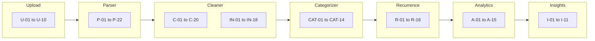

# RupeeRadar — Edge Cases & Corner Cases

This document catalogs known edge cases, failure modes, and corner scenarios for RupeeRadar. Use it during implementation, testing, and demo prep alongside [architecture.md](./architecture.md) and [implementation-plan.md](./implementation-plan.md).

Each entry includes **scenario**, **example**, **expected behavior**, **priority**, and **relevant phase**.

**Priority legend**

| Priority | Meaning |
|----------|---------|
| **P0** | Must handle before demo; incorrect behavior breaks trust or flow |
| **P1** | Should handle; degrade gracefully if not fully solved |
| **P2** | Nice to have; document as known limitation |

---

## 1. File Upload & Input

| ID | Scenario | Example | Expected behavior | Priority | Phase |
|----|----------|---------|-------------------|----------|-------|
| U-01 | Empty file uploaded | 0-byte `.csv` | 422 — "No transactions found" | P0 | 1, 2 |
| U-02 | Unsupported file type | `.docx`, `.png`, `.zip` | 400 — list supported formats (`.csv`, `.xlsx`, `.pdf`) | P0 | 2, 3 |
| U-03 | File exceeds size limit | 50 MB PDF | 413 or 400 — "File too large"; suggest CSV export | P1 | 2 |
| U-04 | Wrong extension, valid content | Renamed `.txt` containing CSV | Attempt content sniffing; parse if CSV-like, else 400 | P1 | 6 |
| U-05 | Multiple files uploaded at once | Two CSVs in one request | P0: reject with "single file only"; P2: merge support | P1 | 2 |
| U-06 | Upload while previous session active | Second upload same browser session | Create new `job_id`; optionally warn user | P1 | 3 |
| U-07 | Corrupted / truncated file | Half-written CSV mid-row | Parse valid rows; warn dropped rows; fail if zero valid rows | P1 | 1 |
| U-08 | Password-protected Excel/PDF | Encrypted `.xlsx` | 422 — "Remove password protection and re-export" | P2 | 6 |
| U-09 | UTF-8 BOM in CSV | `\ufeff` at file start | Strip BOM; parse normally | P0 | 1 |
| U-10 | Non-UTF-8 encoding | Latin-1 or Windows-1252 CSV | Try UTF-8 first; fallback encodings; replace undecodable chars | P1 | 1 |

---

## 2. CSV / Parser Edge Cases

| ID | Scenario | Example | Expected behavior | Priority | Phase |
|----|----------|---------|-------------------|----------|-------|
| P-01 | Unrecognized column layout | Custom export with non-standard headers | 422 — "Unrecognized format; try CSV export from net banking" | P0 | 1 |
| P-02 | Header row not first row | Bank logo rows before headers | Skip preamble rows; detect header via keyword fuzzy match | P1 | 1 |
| P-03 | Multiple header synonym columns | Both "Description" and "Narration" | Pick best match; prefer column with more non-empty values | P1 | 1 |
| P-04 | Missing date column | Amount + description only | 422 or drop rows without dates; log count | P0 | 1 |
| P-05 | Missing description column | Date + amount only | Use placeholder description `"Unknown"`; flag low confidence | P1 | 1 |
| P-06 | Single amount column (signed) | `-500` debit, `+50000` credit | Negative → debit; positive → credit | P0 | 1 |
| P-07 | Single amount + type column | `Dr` / `Cr` indicator | Map Dr → debit, Cr → credit | P0 | 1 |
| P-08 | Both debit and credit populated | Data entry error on one row | Prefer non-zero column; if both non-zero, flag row invalid | P1 | 1 |
| P-09 | Amount with currency symbol | `₹1,234.56` or `Rs. 1234` | Strip `₹`, `Rs`, commas; parse float | P0 | 1 |
| P-10 | Amount in paise misparsed | `123456` without decimal | Heuristic: if all amounts > 10000 and no decimals, unlikely; document assumption | P2 | 1 |
| P-11 | Date format ambiguity | `01/02/2025` (DD/MM vs MM/DD) | Default `%d/%m/%Y` for Indian banks; allow config override | P0 | 1 |
| P-12 | Two-digit year | `01/02/25` | Parse as 2025; reject years < 1990 or > current+1 | P1 | 1 |
| P-13 | Excel serial date numbers | `45321` in date column | Detect numeric dates; convert from Excel epoch | P1 | 6 |
| P-14 | Quoted CSV fields with commas | `"UPI-SWIGGY, BANGALORE",500` | Proper CSV quoting parser (pandas/python csv) | P0 | 1 |
| P-15 | Multiline description in cell | Description spans two lines | Preserve as single string; normalize whitespace | P1 | 1 |
| P-16 | Summary rows in data | `Opening Balance`, `Closing Balance` | Skip rows matching balance/total keywords | P0 | 1 |
| P-17 | Only header row, no data | Headers present, zero transactions | 422 — "No transactions found" | P0 | 1 |
| P-18 | Duplicate header rows mid-file | Repeated header after page break | Skip duplicate header rows | P2 | 1, 6 |
| P-19 | PDF with no extractable tables | Scanned image PDF | 422 — suggest CSV export; optional OCR out of scope | P1 | 6 |
| P-20 | PDF multi-page fragmented tables | Table split across pages | Best-effort merge; fail gracefully with partial data warning | P2 | 6 |
| P-21 | Excel multiple sheets | Sheet1 = summary, Sheet2 = transactions | Default first sheet; P2: auto-detect sheet with most rows | P1 | 6 |
| P-22 | Inconsistent column order across banks | HDFC vs ICICI column names | Fuzzy header mapping + optional bank preset config | P0 | 1, 6 |

---

## 3. Transaction Cleaner Edge Cases

| ID | Scenario | Example | Expected behavior | Priority | Phase |
|----|----------|---------|-------------------|----------|-------|
| C-01 | Zero amount row | `0.00` debit and credit | Drop row; increment dropped count | P0 | 1 |
| C-02 | Unparseable date | `INVALID`, empty date | Drop row; log source_row | P0 | 1 |
| C-03 | Future-dated transaction | Date > today + 7 days | Flag in metadata; include but warn in UI | P2 | 1 |
| C-04 | Very old transaction | Date from 1990 | Include; set period range accordingly | P2 | 1 |
| C-05 | Exact duplicate rows | Same date, amount, description twice | Flag second as duplicate; exclude from totals or mark `is_duplicate` | P0 | 1 |
| C-06 | Near-duplicate (UPI ref differs) | Same Swiggy ₹450 same day, different UPI IDs | Keep both unless user confirms dedupe; or dedupe by date+amount+merchant | P1 | 1 |
| C-07 | Reversal / refund pair | Debit ₹500 then credit ₹500 same merchant | Keep both; P2: detect reversal pairs | P1 | 1 |
| C-08 | Empty description | Blank narration field | `description_clean = "Unknown transaction"` | P0 | 1 |
| C-09 | Extremely long description | 2000-char UPI string | Truncate for display; keep full in `description_raw` | P1 | 1 |
| C-10 | UPI boilerplate noise | `UPI/123456789012/SWIGGY/PAYTM/` | Strip refs; extract `SWIGGY` as merchant | P0 | 1 |
| C-11 | IMPS/NEFT/RTGS prefixes | `IMPS/P2A/...`, `NEFT-INW-...` | Strip channel boilerplate; preserve counterparty name | P0 | 1 |
| C-12 | Card transaction masked IDs | `POS 123456XXXXXX7890 AMAZON` | Strip card mask; extract `AMAZON` | P1 | 1 |
| C-13 | All-caps vs mixed case | `swiggy`, `SWIGGY`, `Swiggy` | Normalize to uppercase for matching; preserve original in raw | P0 | 1 |
| C-14 | Special characters only description | `***`, `---` | Category `Other`; merchant `None` | P1 | 1 |
| C-15 | Internal transfer between own accounts | `SELF TRANSFER`, same name credit/debit | P2: detect and exclude from income/spend totals | P1 | 1, 5 |
| C-16 | Cash withdrawal ATM | `ATM WDL`, `NFS/CASH` | Category `Other` or dedicated `Cash` if added; not Food/Shopping | P1 | 1 |
| C-17 | Failed transaction with zero net | Authorization hold reversed | Usually absent in statement; if present, drop zero-net | P2 | 1 |
| C-18 | Negative amount in debit column | `-500` in withdrawal column | Take absolute value; type = debit | P0 | 1 |
| C-19 | Transaction on month boundary | `2025-01-31` and `2025-02-01` | Include in correct monthly bucket | P0 | 1 |
| C-20 | Same merchant, different amounts same day | Two Swiggy orders | Keep as separate transactions | P0 | 1 |

---

## 4. Indian Banking & UPI Description Patterns

Real-world messy descriptions the cleaner and categorizer must tolerate.

| ID | Pattern | Example narration | Expected handling | Priority | Phase |
|----|---------|-------------------|---------------------|----------|-------|
| IN-01 | UPI P2M | `UPI-SWIGGY@ybl-HDFC0001234-123456789012-Payment` | Merchant: Swiggy → Food | P0 | 1 |
| IN-02 | UPI P2P person name | `UPI/RAHUL SHARMA/123456@paytm` | Category Other or Transfer; not Salary | P0 | 1 |
| IN-03 | Phone number in description | `9876543210@ybl` | Strip from LLM payload; do not log at INFO | P0 | 1, 5 |
| IN-04 | Account number fragments | `A/C **1234`, `XX1234` | Strip before LLM; never include in report | P0 | 5, 7 |
| IN-05 | Paytm / PhonePe / GPay wrapper | `Paytm *Swiggy`, `PhonePe Transfer` | Extract underlying merchant | P0 | 1 |
| IN-06 | Amazon Pay variant | `AMAZON PAY INDIA`, `AMZN MKTP` | Shopping | P0 | 1 |
| IN-07 | Autopay / SI | `SI HDFC CARD`, `AUTOPAY NETFLIX` | Subscriptions or Bills | P0 | 1 |
| IN-08 | EMI keywords | `EMI`, `LOAN`, `BAJAJ FIN`, `HDFC LOAN` | EMI category | P0 | 1 |
| IN-09 | SIP / investment | `SIP`, `GROWW`, `ZERODHA`, `CAMS`, `KFINTECH` | Investments | P0 | 1 |
| IN-10 | Salary credit variants | `SALARY`, `PAYROLL`, `NEFT CR-EMPLOYER NAME` | Salary | P0 | 1 |
| IN-11 | Rent patterns | `RENT`, landlord name, round ₹X0,000 monthly | Rent (also recurrence candidate) | P1 | 1, 2 |
| IN-12 | Fuel / toll | `IOCL`, `BPCL`, `FASTag`, `NPCI NETC` | Travel or Bills | P1 | 1 |
| IN-13 | Insurance premium | `LIC`, `HDFC LIFE`, `POLICYBAZAAR` | Recurring + Bills/Other | P1 | 2 |
| IN-14 | Government / tax | `ITR`, `GST`, `Challan` | Bills or Other | P2 | 1 |
| IN-15 | Abbreviated merchant | `AMZN`, `FLPKRT`, `ZMT` | Map via rules dictionary | P1 | 1, 5 |
| IN-16 | Failed UPI in statement | Rare; usually not listed | N/A — skip if not present | P2 | 1 |
| IN-17 | Cashback credit | `CASHBACK`, `REVERSAL CASHBACK` | Credit; category Other; not Salary | P1 | 1 |
| IN-18 | Interest credit | `INT PAID`, `Savings Interest` | Credit; category Other or Investments | P2 | 1 |

---

## 5. Categorizer Edge Cases

| ID | Scenario | Example | Expected behavior | Priority | Phase |
|----|----------|---------|-------------------|----------|-------|
| CAT-01 | Unknown merchant | `UPI/UNKNOWN SHOP 123` | Category `Other`, confidence 0.0 | P0 | 1 |
| CAT-02 | Multi-category merchant | Amazon (Shopping) vs Amazon Prime (Subscriptions) | Prefer more specific rule; LLM disambiguation if enabled | P1 | 1, 5 |
| CAT-03 | Keyword collision | `UBER EATS` (Food) vs `UBER TRIP` (Travel) | Longest / most specific rule wins | P0 | 1 |
| CAT-04 | Credit misclassified as expense | Salary credited | Must be Salary, not Other | P0 | 1 |
| CAT-05 | Debit misclassified as income | Refund shown as credit | Credit type; category from merchant (Shopping refund) | P1 | 1 |
| CAT-06 | Rule confidence threshold | Partial match `MART` → Shopping? | Low confidence → LLM or Other | P1 | 1, 5 |
| CAT-07 | LLM returns invalid category | `"Entertainment"` (not in enum) | Map to nearest valid or `Other`; log warning | P1 | 5 |
| LLM-08 | LLM timeout / rate limit | API 429 or 30s timeout | Fall back to rule-only; no user-visible failure | P0 | 5 |
| CAT-09 | LLM hallucinated category | High confidence but wrong | Cap LLM confidence at 0.85; allow user override (P2) | P1 | 5 |
| CAT-10 | Empty merchant, generic description | `UPI PAYMENT` | Other; send to LLM batch if enabled | P1 | 5 |
| CAT-11 | Investment vs EMI confusion | `HDFC` could be bank EMI or mutual fund | Use keyword context: `SIP`, `MF`, `EMI` | P1 | 1 |
| CAT-12 | Subscription vs Bills | `AIRTEL` postpaid vs prepaid recharge | Bills vs Subscriptions; rule by amount pattern | P2 | 1 |
| CAT-13 | All transactions uncategorized | Obscure regional bank export | ≥ 80% may be Other; insights still generated from totals | P1 | 1 |
| CAT-14 | User manual override | User sets Food → Travel | Update session state; recalculate metrics | P2 | 8 |

---

## 6. Recurrence Detection Edge Cases

| ID | Scenario | Example | Expected behavior | Priority | Phase |
|----|----------|---------|-------------------|----------|-------|
| R-01 | Only one occurrence | Single Netflix charge in 3-month file | **Not** recurring; `is_recurring = false` | P0 | 2 |
| R-02 | Same amount, different merchants | ₹499 to multiple apps | Do not group together | P0 | 2 |
| R-03 | Same merchant, variable amounts | Swiggy orders ₹200–₹800 | **Not** subscription recurring | P0 | 2 |
| R-04 | Subscription price change | Netflix ₹649 → ₹699 | Group if within ±5% variance or update median | P1 | 2 |
| R-05 | Annual subscription | ₹999 once per year | Detect `yearly` frequency; `monthly_estimate = amount/12` | P1 | 2 |
| R-06 | Weekly recurring | Weekly maid payment | Detect `weekly`; monthly_estimate = amount × 4.33 | P2 | 2 |
| R-07 | Bi-monthly EMI | Every 2 months | Detect `quarterly` or custom; document limitation | P2 | 2 |
| R-08 | Rent on varying dates | 28th–32nd (month end) | Allow interval 27–35 days for monthly | P0 | 2 |
| R-09 | EMI exact same amount | ₹15,000 every month | Strong recurring signal; type `emi` | P0 | 2 |
| R-10 | SIP same amount monthly | ₹5,000 Groww SIP | Type `sip`; category Investments | P0 | 2 |
| R-11 | Salary credit recurring | Monthly salary | Detect as recurring credit; **exclude** from recurring spend total | P1 | 2 |
| R-12 | Duplicate recurring detection | Netflix already grouped | One `RecurringGroup` per pattern | P0 | 2 |
| R-13 | Statement shorter than 2 periods | 1-month CSV | Few or no recurring groups; insights skip subscription count | P0 | 2 |
| R-14 | Merchant unknown, amount identical monthly | ₹25,000 monthly, no name | Fallback amount-bucket grouping; label "₹25,000 monthly payment" | P1 | 2 |
| R-15 | Cancelled subscription | 2 charges then stops | Still show as recurring within observed period; note in label | P2 | 2 |
| R-16 | Insurance quarterly | ₹4,000 every 3 months | frequency `quarterly`; monthly_estimate = amount/3 | P2 | 2 |

---

## 7. Analytics Edge Cases

| ID | Scenario | Example | Expected behavior | Priority | Phase |
|----|----------|---------|-------------------|----------|-------|
| A-01 | No credit transactions | Spend-only statement | `total_income = 0`; `savings` negative; hide `savings_rate` | P0 | 1 |
| A-02 | No debit transactions | Credits only (salary account) | `total_spend = 0`; show income insights | P1 | 1 |
| A-03 | Empty after cleaning | All rows dropped | 422 — no valid transactions | P0 | 1 |
| A-04 | Single transaction | One row CSV | Valid metrics; insights still ≥ 3 (generic templates) | P0 | 2 |
| A-05 | Division by zero savings rate | Income = 0 | `savings_rate = null`; UI shows "N/A" | P0 | 1, 3 |
| A-06 | All spend in one category | Only Food debits | Top category = 100%; insight reflects dominance | P0 | 2 |
| A-07 | Equal top categories | Food ₹5000, Travel ₹5000 | Return both in `top_categories`; stable sort by name | P1 | 1 |
| A-08 | Cross-month statement | Jan 15 – Mar 10 data | `monthly_spend` has multiple buckets; period reflects full range | P0 | 1 |
| A-09 | Leap year / February | Feb 29 transactions | Parse correctly; include in February bucket | P2 | 1 |
| A-10 | Internal transfers inflating totals | Self NEFT credit + debit | P2: exclude pairs; P1: include with disclaimer | P1 | 1 |
| A-11 | Biggest debit tie | Two ₹45,000 transactions | Return both or first by date; UI shows tie | P2 | 1 |
| A-12 | Floating point aggregation | Many ₹0.01 rounding | Round display to 2 decimals; use consistent rounding in report | P1 | 1, 4 |
| A-13 | Negative savings | Spend > income in period | Show negative savings; insight flags overspending | P0 | 2 |
| A-14 | Recurring total > total spend | Bug or overlapping groups | Cap recurring_monthly_total; assert ≤ total_spend × months | P1 | 2 |
| A-15 | Category totals ≠ total spend | Uncategorized excluded | `sum(by_category) ≈ total_spend`; Other captures remainder | P0 | 1 |

---

## 8. Insight Generator Edge Cases

| ID | Scenario | Example | Expected behavior | Priority | Phase |
|----|----------|---------|-------------------|----------|-------|
| I-01 | Fewer than 3 rule triggers | Minimal data | Fallback generic insights: total spend, txn count, period | P0 | 2 |
| I-02 | No recurring detected | No subscriptions | Skip recurring insight; use other templates | P0 | 2 |
| I-03 | MoM with single month | One month of data | Skip MoM spike insight | P0 | 2 |
| I-04 | MoM prior month zero spend | New category this month | Avoid divide-by-zero; say "new spending in X" | P1 | 2 |
| I-05 | LLM insight with wrong amount | "You spent ₹99,999" (not in data) | Reject insight; validation against metrics whitelist | P0 | 5 |
| I-06 | Duplicate insight messages | Two "Food is largest" | Deduplicate by title/body similarity | P1 | 2 |
| I-07 | Top category below 30% threshold | Spread evenly | Still emit "largest category" insight with actual % | P0 | 2 |
| I-08 | Very small spend total | ₹500 total | Insights use actual numbers; no condescending tone | P1 | 2 |
| I-09 | LLM unavailable | API down | Template-only; still ≥ 3 insights | P0 | 5 |
| I-10 | Extremely high spend outlier | ₹500,000 one-time | Biggest debit insight; don't let it dominate all insights | P1 | 2 |
| I-11 | Insight references date user misreads | "March 1 rent" | Use ISO date in backend; format for locale in UI | P1 | 3 |

---

## 9. API & Session Edge Cases

| ID | Scenario | Example | Expected behavior | Priority | Phase |
|----|----------|---------|-------------------|----------|-------|
| API-01 | Invalid job_id | Random UUID | 404 — "Analysis not found" | P0 | 2 |
| API-02 | Expired session | GET after TTL (60 min) | 404 or 410 Gone — "Session expired; upload again" | P0 | 2 |
| API-03 | DELETE already deleted job | Double DELETE | 404 (idempotent) or 204 | P1 | 2 |
| API-04 | Concurrent analyze requests | 10 parallel uploads | Handle 5–10 users; queue or process in parallel | P1 | 7 |
| API-05 | Sync timeout on large file | 5000 rows + LLM | P1: extend timeout; P2: async job polling | P1 | 5, 7 |
| API-06 | Malformed multipart | Missing file field | 400 — "File required" | P0 | 2 |
| API-07 | GET transactions invalid page | `page=-1`, `size=0` | 400 or default to page=1, size=50 | P1 | 2 |
| API-08 | Filter by invalid category | `category=Invalid` | 400 or empty result with valid enum list | P1 | 2 |
| API-09 | CORS from unknown origin | Random domain | Reject in production; allow dev localhost | P1 | 0, 7 |
| API-10 | Server restart loses in-memory store | Deploy during demo | Document limitation; use SQLite for persistence | P1 | 2, 7 |
| API-11 | Error response leaks stack trace | 500 error | Generic message to client; stack trace server-side only | P0 | 7 |
| API-12 | Error response leaks statement | Parse exception | Never include raw file content in JSON error | P0 | 2, 7 |

---

## 10. Frontend & UX Edge Cases

| ID | Scenario | Example | Expected behavior | Priority | Phase |
|----|----------|---------|-------------------|----------|-------|
| UX-01 | API unreachable | Backend down | Error state with retry; no infinite spinner | P0 | 3 |
| UX-02 | Very long transaction list | 2000 rows | Pagination or virtual scroll; don't render all at once | P1 | 3 |
| UX-03 | Zero transactions after filter | Filter category with no matches | Empty state: "No transactions match" | P1 | 3 |
| UX-04 | All categories Other | Poor rules | Chart still renders; show categorization disclaimer | P1 | 3 |
| UX-05 | Large INR values | ₹1,00,00,000 | Indian numbering format or standard ₹1,000,000.00 — pick one consistently | P1 | 3 |
| UX-06 | Mobile narrow screen | Phone viewport | Responsive cards; horizontal scroll table | P1 | 3 |
| UX-07 | Browser refresh mid-session | F5 on dashboard | Lose state unless job_id in URL/localStorage | P1 | 3 |
| UX-08 | Upload same file twice | Duplicate click | New analysis or idempotent warning | P2 | 3 |
| UX-09 | Slow network upload | 10s upload | Progress indicator on file upload | P1 | 3 |
| UX-10 | Empty insight amount field | Insight without amount | Render body only; hide amount badge | P1 | 3 |
| UX-11 | Chart with one category | 100% Food | Render single-segment chart without error | P0 | 3 |
| UX-12 | Delete data confirmation | Click "Delete my data" | Confirm dialog; redirect to upload | P1 | 3 |

---

## 11. Report Export Edge Cases

| ID | Scenario | Example | Expected behavior | Priority | Phase |
|----|----------|---------|-------------------|----------|-------|
| REP-01 | Report for expired job | Export after TTL | 404 — prompt re-upload | P0 | 4 |
| REP-02 | PDF engine missing fonts | Docker without DejaVu | Embed fonts or fallback to HTML print | P1 | 4 |
| REP-03 | Report numbers ≠ dashboard | Rounding difference | Single source of truth from same `AnalysisResult` | P0 | 4 |
| REP-04 | Very long transaction appendix | 5000 rows PDF | Paginate; optional omit appendix default | P1 | 4 |
| REP-05 | Special chars in description | Unicode, emoji | Render correctly in PDF/HTML | P1 | 4 |
| REP-06 | Empty recurring section | No recurring | Show "No recurring payments detected" | P0 | 4 |
| REP-07 | Print from browser | User Print → PDF | Print CSS hides nav buttons | P1 | 4 |

---

## 12. Privacy & Security Edge Cases

| ID | Scenario | Example | Expected behavior | Priority | Phase |
|----|----------|---------|-------------------|----------|-------|
| SEC-01 | Account number in CSV | Column "Account No." | Do not store or display in UI/report | P0 | 1, 3 |
| SEC-02 | Full statement in application logs | Debug print | Never log raw upload at INFO | P0 | 2, 7 |
| SEC-03 | LLM prompt contains phone/account | UPI string | Sanitize `\d{10,}` before API call | P0 | 5 |
| SEC-04 | Session hijack via guessable ID | Incremental IDs | Use UUID v4 for job_id | P0 | 2 |
| SEC-05 | Uploaded file retained forever | Disk accumulation | TTL purge + DELETE endpoint | P0 | 2 |
| SEC-06 | XSS in transaction description | `` | Escape on render in React | P0 | 3 |
| SEC-07 | Path traversal filename | `../../etc/passwd.csv` | Sanitize stored filename | P1 | 2 |
| SEC-08 | Report shared publicly | User shares PDF | User responsibility; no extra PII beyond statement | P1 | 4 |

---

## 13. Performance Edge Cases

| ID | Scenario | Target | Expected behavior | Priority | Phase |
|----|----------|--------|-------------------|----------|-------|
| PERF-01 | ~500 transactions, no LLM | < 3s | Complete sync response | P1 | 7 |
| PERF-02 | ~500 transactions + LLM 50 batch | < 15s | Acceptable with loading UI | P1 | 5 |
| PERF-03 | PDF parse large file | < 30s | Progress or timeout message | P1 | 6 |
| PERF-04 | 10 concurrent uploads | Demo load | No crash; graceful slowdown | P2 | 7 |
| PERF-05 | Memory spike on huge CSV | 100k rows | File size limit or stream parsing | P2 | 7 |

---

## 14. End-to-End Scenario Matrix

Critical user journeys to manually test before demo:

| # | Journey | Key edge cases exercised |
|---|---------|--------------------------|
| E2E-1 | Happy path: sample CSV → dashboard → export | P-09, C-10, CAT-01, R-02, I-01 |
| E2E-2 | Messy UPI file | IN-01–IN-05, C-06, C-10 |
| E2E-3 | Recurring-heavy 3-month file | R-01, R-09, R-10, I-02 |
| E2E-4 | Spend-only (no salary credits) | A-01, A-05, I-01 |
| E2E-5 | Unrecognized bank format | P-01, API-12 |
| E2E-6 | Delete data flow | SEC-05, API-03, UX-12 |
| E2E-7 | LLM disabled | CAT-08, I-09 |
| E2E-8 | Session expired | API-02, REP-01 |

---

## 15. Recommended Golden Test Files

Add to `sample_data/` per [implementation-plan.md](./implementation-plan.md):

| File | Edge cases covered |
|------|-------------------|
| `sample_statement.csv` | Baseline happy path |
| `upi_food.csv` | IN-01, IN-05, C-10, CAT-03 |
| `mixed_spend.csv` | Multi-category, cross-month (A-08) |
| `recurring_heavy.csv` | R-09, R-10, R-08, I-02 |
| `spend_only.csv` | A-01, A-05, no credits |
| `messy_headers.csv` | P-02, P-22, P-14 |
| `duplicates.csv` | C-05, C-06 |
| `single_month.csv` | R-13, I-03 |
| `empty_and_invalid.csv` | U-01, P-17, C-01, C-02 |
| `large_amounts.csv` | P-09, A-12, UX-05 |

---

## 16. Known Limitations (Document in README)

Acceptable prototype limitations — do not block demo:

- Single bank CSV format optimized first; others may need column mapping config
- PDF parsing best-effort only; scanned PDFs unsupported
- P2P UPI transfers categorized as `Other`, not peer names
- Internal account transfers may double-count income/spend
- Bi-weekly / irregular recurring patterns may be missed
- No multi-user auth or encrypted long-term storage
- Categorization accuracy depends on rule coverage and optional LLM

---

## 17. Edge Case → Component Quick Reference

---

## 18. Pre-Demo Checklist

Before submission or live demo, verify:

- [ ] U-01, U-02, P-01, P-17 return correct HTTP errors
- [ ] C-01, C-05, C-10 handled without crash
- [ ] A-01 shows N/A savings rate (not NaN or Infinity)
- [ ] I-01 always produces ≥ 3 insights
- [ ] R-01 does not false-positive single charges
- [ ] SEC-01, SEC-02, SEC-03 no PII in logs/LLM
- [ ] REP-03 report matches dashboard totals
- [ ] E2E-1 through E2E-6 pass manually

---

*Derived from [architecture.md](./architecture.md) and [implementation-plan.md](./implementation-plan.md). Extend this document as new edge cases are discovered during development.*
