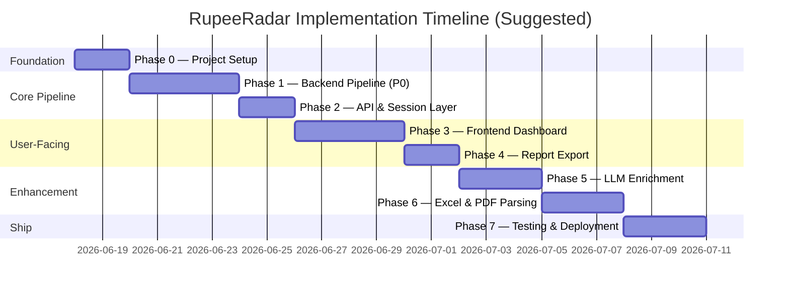
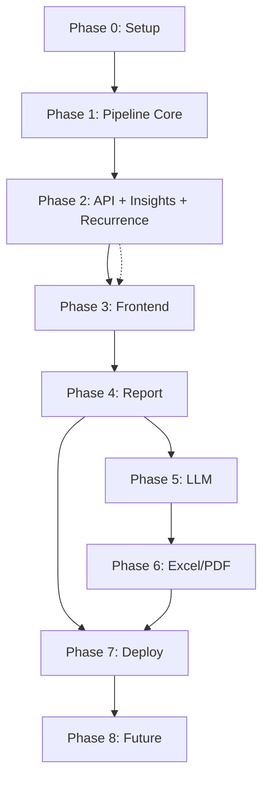

# RupeeRadar — Phase-Wise Implementation Plan

This document breaks down the build into ordered phases aligned with [architecture.md](./architecture.md) and [context.md](./context.md). Each phase has clear tasks, deliverables, and exit criteria so the team can ship a demo-ready prototype first, then layer enhancements.

---

## Plan Overview

| Phase | Name                                                 | Priority | Est. Duration | Demo-blocking? |
| ----- | ---------------------------------------------------- | -------- | ------------- | -------------- |
| 0     | Project setup & scaffolding                          | Must     | 1–2 days      | Yes            |
| 1     | Backend pipeline core (CSV, clean, rules, analytics) | Must     | 3–4 days      | Yes            |
| 2     | Recurrence, insights, orchestrator, API              | Must     | 2–3 days      | Yes            |
| 3     | Frontend dashboard & upload flow                     | Must     | 3–4 days      | Yes            |
| 4     | Report export (HTML/PDF)                             | Must     | 1–2 days      | Yes            |
| 5     | LLM categorization & insight enrichment              | Should   | 2–3 days      | No             |
| 6     | Excel & PDF statement support                        | Should   | 2–3 days      | No             |
| 7     | Testing, polish, deployment                          | Must     | 2–3 days      | Yes            |
| 8     | Post-prototype extensions                            | Could    | Ongoing       | No             |

**Minimum viable demo:** Complete Phases 0–4 and 7. Phases 5–6 improve accuracy and format coverage but are not required for a working end-to-end submission.

---

## Phase 0 — Project Setup & Scaffolding

**Goal:** Establish repo structure, dev environment, shared types, and sample data so backend and frontend can be built in parallel from Phase 1 onward.

### Tasks

#### 0.1 Repository & tooling

- [ ] Initialize git repository and `.gitignore` (exclude `.env`, `__pycache__`, `node_modules`, uploads)
- [ ] Create folder structure per architecture §8
- [ ] Add root `README.md` with setup instructions and project overview
- [ ] Add `.env.example` with `LLM_API_KEY`, `SESSION_TTL_MINUTES`, `VITE_API_URL`

#### 0.2 Backend scaffold

- [ ] Create `backend/requirements.txt`: FastAPI, uvicorn, pandas, python-multipart, pydantic, pytest
- [ ] Create `backend/app/main.py` with FastAPI app, CORS, `/api/v1/health`
- [ ] Create `backend/app/models/` — `transaction.py`, `analysis.py` with Pydantic/dataclass schemas
- [ ] Create empty pipeline module stubs: `orchestrator.py`, `cleaner.py`, `analytics.py`, `recurrence.py`, `insights.py`
- [ ] Create `backend/app/config/categories.json` and `merchant_rules.json` (seed with architecture examples)

#### 0.3 Frontend scaffold

- [ ] Scaffold React + Vite + TypeScript project in `frontend/`
- [ ] Add Tailwind CSS and Recharts
- [ ] Create `frontend/src/types/finance.ts` mirroring backend schemas
- [ ] Create `frontend/src/api/client.ts` with base URL from env
- [ ] Add placeholder routes/pages: Upload, Dashboard

#### 0.4 Sample data

- [ ] Create `sample_data/sample_statement.csv` — 50–100 realistic Indian bank rows
- [ ] Plan golden files for later: `upi_food.csv`, `mixed_spend.csv`, `recurring_heavy.csv`

#### 0.5 Dev workflow

- [ ] Add `docker-compose.yml` (backend + frontend services)
- [ ] Verify local run: backend health check + frontend loads

### Deliverables

- Runnable empty shell: `GET /api/v1/health` → 200, frontend loads at `localhost:5173`
- Shared data models documented in code
- One sample CSV for manual testing

### Exit criteria

- [ ] Backend and frontend start without errors
- [ ] CORS configured for local dev
- [ ] Sample CSV committed and documented in README

---

## Phase 1 — Backend Pipeline Core (P0)

**Goal:** Implement CSV ingestion, transaction cleaning, rule-based categorization, and analytics — the data backbone of RupeeRadar. No UI required yet; validate via unit tests and a CLI/script.

**Maps to architecture:** §4.3 Ingestion, §4.4 Cleaner, §4.5 Categorizer (Layer 1), §4.7 Analytics

### Tasks

#### 1.1 Data models

- [ ] Implement `RawTransaction` dataclass
- [ ] Implement `Transaction` dataclass with all fields from architecture §4.4
- [ ] Implement `FinancialMetrics`, `CategorySummary`, `MonthlySpend`
- [ ] Define `Category` enum: Food, Travel, Shopping, Bills, EMI, Subscriptions, Salary, Rent, Investments, Other

#### 1.2 CSV parser (`pipeline/ingestion/csv_parser.py`)

- [ ] Implement `StatementParser` protocol
- [ ] Auto-detect columns via fuzzy header matching (`date`, `narration`, `debit`, `credit`, etc.)
- [ ] Support configurable column mapping JSON override
- [ ] Parse multiple date formats (`%d/%m/%Y`, `%d-%m-%Y`, `%Y-%m-%d`)
- [ ] Handle debit/credit columns OR single amount column
- [ ] Return `list[RawTransaction]` with `source_row` for debugging
- [ ] Reject empty files with clear error

#### 1.3 Transaction cleaner (`pipeline/cleaner.py`)

- [ ] Date normalization → ISO `YYYY-MM-DD`
- [ ] Amount resolution: positive `amount` + `type` (debit/credit)
- [ ] Description cleanup: whitespace, UPI/IMPS boilerplate stripping
- [ ] Merchant extraction via regex/keyword (SWIGGY, AMZN, NETFLIX, etc.)
- [ ] Deduplication hash on `(date, amount, normalized_description)`
- [ ] Drop invalid rows; return stats (dropped count, duplicate count)

#### 1.4 Rule-based categorizer (`pipeline/categorizer/rules.py`)

- [ ] Load rules from `merchant_rules.json`
- [ ] Keyword matching (case-insensitive) on `description_clean` and `merchant`
- [ ] Credit-side rules: SALARY, NEFT CREDIT → Salary
- [ ] Assign `category` and `category_confidence` (0.9 for exact keyword, 0.7 for partial)
- [ ] Default unmatched debits/credits to `Other` with confidence 0.0

#### 1.5 Analytics engine (`pipeline/analytics.py`)

- [ ] Compute `total_income`, `total_spend`, `savings`, `savings_rate`
- [ ] Group debits by category → `by_category`, `top_categories`
- [ ] Find `biggest_debit`, `biggest_credit`
- [ ] Group monthly spend → `monthly_spend`
- [ ] Set `period_start`, `period_end` from transaction date range

#### 1.6 Unit tests

- [ ] Parser: column detection, date/amount parsing, empty file
- [ ] Cleaner: UPI string normalization, deduplication
- [ ] Categorizer: golden tests — known merchants → expected category
- [ ] Analytics: metric calculations, edge case (no credits → savings_rate null)

### Deliverables

- Pipeline script or pytest that runs: `CSV → clean → categorize → metrics` and prints JSON summary
- ≥ 80% of sample CSV merchants categorized correctly (manual review)

### Exit criteria

- [ ] `sample_statement.csv` produces valid `FinancialMetrics`
- [ ] All Phase 1 unit tests pass
- [ ] No hardcoded bank-specific logic in cleaner (keep bank quirks in parser config)

---

## Phase 2 — Recurrence Detection, Insights, Orchestrator & API

**Goal:** Complete the backend pipeline, wire the orchestrator, and expose REST endpoints so the frontend can integrate in Phase 3.

**Maps to architecture:** §4.2 API, §4.6 Recurrence, §4.8 Insights, §5 Data Flow, §6 Storage

### Tasks

#### 2.1 Recurrence detector (`pipeline/recurrence.py`)

- [ ] Group debits by normalized merchant (fallback: amount bucket)
- [ ] Require ≥ 2 occurrences per group
- [ ] Check amount variance (stdev/mean < 0.05)
- [ ] Check interval regularity (monthly ≈ 28–31 days)
- [ ] Classify type: subscription, emi, rent, sip, insurance, other
- [ ] Emit `RecurringGroup` with `monthly_estimate`, `transaction_ids`
- [ ] Merge `is_recurring` and `recurring_group_id` back onto transactions

#### 2.2 Template insight generator (`pipeline/insights.py`)

- [ ] Implement rule-triggered templates (architecture §4.8 Tier 1):
  - [ ] Top category share insight
  - [ ] Recurring total insight
  - [ ] Biggest debit insight
  - [ ] Subscription count insight
  - [ ] MoM spike (if ≥ 2 months of data)
- [ ] Guarantee ≥ 3 insights for any non-empty statement
- [ ] Return `list[Insight]` with `source: "template"`

#### 2.3 Pipeline orchestrator (`pipeline/orchestrator.py`)

- [ ] Implement `run_analysis(file) -> AnalysisResult` per architecture §4.2
- [ ] Wrap stages with timing logs (no sensitive data in logs)
- [ ] Handle stage errors with structured exceptions

#### 2.4 Session / job store

- [ ] In-memory dict or SQLite store keyed by `job_id` (UUID)
- [ ] Store `AnalysisResult`, `created_at`, `expires_at` (TTL default 60 min)
- [ ] Background task or startup hook to purge expired sessions

#### 2.5 API routes (`api/routes/analyze.py`)

- [ ] `POST /api/v1/analyze` — multipart upload, sync response with full result + `job_id`
- [ ] `GET /api/v1/analyze/{job_id}` — retrieve stored result
- [ ] `GET /api/v1/analyze/{job_id}/transactions` — paginated (optional query: category, recurring)
- [ ] `DELETE /api/v1/analyze/{job_id}` — purge session
- [ ] Error responses: 400 (bad file type), 422 (parse fail / empty), 500 (generic)

#### 2.6 Integration tests

- [ ] `POST /api/v1/analyze` with sample CSV → 200 + valid JSON schema
- [ ] `GET` and `DELETE` lifecycle test
- [ ] Insights count ≥ 3 assertion

### Deliverables

- Fully working backend API processable via curl/Postman/Swagger (`/docs`)
- Example response JSON committed as `sample_data/sample_analysis_output.json`

### Exit criteria

- [ ] End-to-end API call with sample CSV returns transactions, metrics, recurring groups, ≥ 3 insights
- [ ] Session TTL and DELETE work
- [ ] Swagger UI documents all endpoints

---

## Phase 3 — Frontend Dashboard & Upload Flow

**Goal:** Build the user-facing application: upload a statement, see processing state, explore dashboard, transactions, recurring payments, and insights.

**Maps to architecture:** §4.1 Presentation Layer, §5 sequence diagram

### Tasks

#### 3.1 Upload & processing

- [ ] `UploadZone.tsx` — drag-and-drop, file type validation (CSV first)
- [ ] `useAnalysis.ts` hook — call `POST /api/v1/analyze`, handle loading/error states
- [ ] Processing spinner/skeleton while awaiting response
- [ ] Error toasts for 400/422 with user-friendly messages

#### 3.2 Dashboard summary

- [ ] `SummaryCards.tsx` — Total Income, Total Spend, Savings, Transaction Count (₹ formatting)
- [ ] `CategoryChart.tsx` — donut or bar chart from `metrics.by_category` (Recharts)
- [ ] Period display (`period_start` – `period_end`)
- [ ] Optional: monthly spend line/bar chart from `metrics.monthly_spend`

#### 3.3 Transaction table

- [ ] `TransactionTable.tsx` — columns: date, raw description, cleaned description, amount, type, category, recurring badge
- [ ] Search by description
- [ ] Filter by category and recurring flag
- [ ] Sort by date, amount

#### 3.4 Recurring payments view

- [ ] `RecurringList.tsx` — label, type, amount, frequency, monthly estimate
- [ ] Summary header: total recurring monthly cost
- [ ] Link or expand to show related transaction IDs

#### 3.5 Insights panel

- [ ] `InsightCards.tsx` — title, body, supporting amount, severity styling
- [ ] Display all insights (minimum 3)

#### 3.6 Navigation & layout

- [ ] App shell with RupeeRadar branding
- [ ] Tabbed or routed views: Dashboard | Transactions | Recurring | Insights
- [ ] Responsive layout (mobile-friendly cards, scrollable table)
- [ ] Empty state before upload; reset / upload new file action

#### 3.7 Privacy UX

- [ ] "Delete my data" button → `DELETE /api/v1/analyze/{job_id}`
- [ ] Short privacy note on upload screen (data not stored permanently)

### Deliverables

- Working UI connected to backend API
- Demo flow: upload `sample_statement.csv` → full dashboard populated

### Exit criteria

- [ ] All deliverable checklist items from context.md visible in UI (except report export — Phase 4)
- [ ] No console errors on happy path
- [ ] INR currency formatted consistently

---

## Phase 4 — Report Export

**Goal:** Generate a downloadable, shareable financial summary report.

**Maps to architecture:** §4.9 Report Generator

### Tasks

#### 4.1 Backend report generator (`report/generator.py`)

- [ ] HTML template with sections: cover, executive summary, category breakdown, recurring list, insights, top 5 debits
- [ ] `GET /api/v1/analyze/{job_id}/report?format=html|pdf`
- [ ] PDF via `weasyprint` or HTML print stylesheet (choose one for prototype)
- [ ] Include generated date and period; no raw account numbers

#### 4.2 Frontend export

- [ ] `ReportView.tsx` — in-browser HTML preview
- [ ] "Export PDF" / "Download Report" button
- [ ] Optional: "Print" using browser print for zero-dependency PDF

#### 4.3 Styling

- [ ] Print-friendly CSS (A4, page breaks)
- [ ] RupeeRadar branding on cover section

### Deliverables

- PDF or print-quality HTML report downloadable from dashboard

### Exit criteria

- [ ] Report contains all 6 required sections from architecture §4.9 (appendix optional)
- [ ] Report numbers match dashboard metrics exactly
- [ ] **All context.md deliverable checkboxes can be marked complete**

---

## Phase 5 — LLM Enrichment (Optional but Recommended)

**Goal:** Improve categorization accuracy and insight quality for messy descriptions using LLM fallback, while preserving privacy guardrails.

**Maps to architecture:** §4.5 Layer 2, §4.8 Tier 2, §7.2 LLM data handling

### Tasks

#### 5.1 LLM infrastructure

- [ ] Add LLM client module (OpenAI / Anthropic / compatible API)
- [ ] Environment config: `LLM_API_KEY`, model name, timeout
- [ ] Pre-LLM sanitization: strip `\d{10,}`, account-like patterns

#### 5.2 LLM categorizer (`pipeline/categorizer/llm_classifier.py`)

- [ ] Batch transactions with `category_confidence < 0.8` (max 50 per call)
- [ ] Structured JSON output prompt with category definitions + Indian examples
- [ ] Merge LLM results; cap confidence at 0.85
- [ ] Fallback: if LLM fails, keep rule-based result

#### 5.3 LLM insight enrichment (`pipeline/insights.py` extension)

- [ ] Send metrics summary + top 20 transactions + recurring summary (sanitized)
- [ ] Generate 3–5 additional or replacement insight strings
- [ ] Validation: reject insights citing amounts not in source data
- [ ] Mark `source: "llm"` on LLM-generated insights

#### 5.4 UI & config

- [ ] Show categorization source/confidence in transaction table (optional column)
- [ ] Feature flag: `ENABLE_LLM=true/false` for offline demo mode

#### 5.5 Tests

- [ ] Mock LLM responses in unit tests
- [ ] Integration test with LLM disabled → template-only still works

### Deliverables

- Hybrid categorization and enriched insights behind feature flag

### Exit criteria

- [ ] Messy/unknown merchants in sample data categorized better vs Phase 1 baseline
- [ ] App works fully with `ENABLE_LLM=false`
- [ ] No full statement or PII sent to LLM (code review checklist)

---

## Phase 6 — Excel & PDF Statement Support

**Goal:** Expand input formats beyond CSV for real-world usability.

**Maps to architecture:** §4.3 phased formats P1 (Excel), P2 (PDF)

### Tasks

#### 6.1 Excel parser (`pipeline/ingestion/excel_parser.py`)

- [ ] Implement `StatementParser` for `.xlsx` via `pandas.read_excel` / `openpyxl`
- [ ] Reuse same column auto-detection as CSV parser
- [ ] Register parser in ingestion router (try parsers by file extension)

#### 6.2 PDF parser (`pipeline/ingestion/pdf_parser.py`)

- [ ] Extract tables via `pdfplumber`
- [ ] Map extracted rows to `RawTransaction`
- [ ] Graceful failure with 422: "Export CSV from net banking"
- [ ] Optional: one bank-specific template (e.g. HDFC or ICICI) if time permits

#### 6.3 Ingestion router

- [ ] `ingestion/router.py` — select parser by extension and `can_parse()`
- [ ] Update upload UI to accept `.csv`, `.xlsx`, `.pdf`
- [ ] Update error messages and README with supported formats

#### 6.4 Tests

- [ ] Sample `.xlsx` and `.pdf` in `sample_data/`
- [ ] Parser unit tests; PDF failure path returns helpful message

### Deliverables

- Multi-format upload working for at least CSV + Excel; PDF best-effort

### Exit criteria

- [ ] Excel sample parses with same output quality as CSV
- [ ] PDF either parses or fails with actionable user message
- [ ] Performance: PDF < 30s for typical statement (architecture §11)

---

## Phase 7 — Testing, Polish & Deployment

**Goal:** Harden the prototype, run E2E tests, deploy publicly, and prepare demo materials.

**Maps to architecture:** §9 Deployment, §10 Testing, §12 Failure Modes

### Tasks

#### 7.1 Test coverage

- [ ] Complete golden test files: `upi_food.csv`, `mixed_spend.csv`, `recurring_heavy.csv`
- [ ] Backend: target ≥ 70% coverage on pipeline modules
- [ ] E2E test (Playwright): upload → dashboard renders summary cards + ≥ 3 insights
- [ ] Manual test checklist for all failure modes (architecture §12)

#### 7.2 UX polish

- [ ] Loading skeletons, empty states, error states on all views
- [ ] Consistent typography and spacing (Tailwind design tokens)
- [ ] Favicon and app title
- [ ] Format hints on upload screen ("Export CSV from your bank app")

#### 7.3 Privacy & security hardening

- [ ] Audit logs: no full descriptions at INFO level
- [ ] Confirm session TTL purge works
- [ ] HTTPS on deployed environment
- [ ] `.env` never committed

#### 7.4 Deployment

- [ ] Dockerize backend and frontend (`Dockerfile` each)
- [ ] `docker-compose.yml` for one-command local demo
- [ ] Deploy backend to Railway / Render / Fly.io
- [ ] Deploy frontend to Vercel / Netlify with `VITE_API_URL` pointing to API
- [ ] Smoke test deployed URL with sample CSV

#### 7.5 Demo preparation

- [ ] Record demo script: upload → dashboard → recurring → insights → export report
- [ ] Update README: live URL, features, limitations, privacy statement
- [ ] Prepare 2-minute pitch aligning with evaluation criteria (context.md)

### Deliverables

- Publicly accessible deployed app OR documented one-command local run
- README with demo instructions
- E2E test passing in CI (optional GitHub Actions)

### Exit criteria

- [ ] Deployed app processes sample CSV end-to-end
- [ ] All context.md success criteria met in production/local docker
- [ ] Known limitations documented (bank formats, LLM optional)

---

## Phase 8 — Post-Prototype Extensions (Future)

**Goal:** Items explicitly deferred in architecture §13. Implement only after Phase 7 demo is stable.

| Item                  | Description                          | Priority |
| --------------------- | ------------------------------------ | -------- |
| Multi-bank plugins    | HDFC, ICICI, SBI PDF/CSV templates   | Medium   |
| User override         | Manual recategorization in UI        | Medium   |
| MoM comparison        | Month-over-month dashboard trends    | Medium   |
| Auth & persistence    | Encrypted user accounts              | Low      |
| Budget alerts         | Set category budgets, warn on exceed | Low      |
| Embeddings clustering | Merchant grouping via embeddings     | Low      |
| On-device LLM         | Full privacy, no cloud API           | Low      |

---

## Dependency Graph

**Parallelization tip:** After Phase 2 API is stable, one developer can start Phase 3 (frontend) while another starts Phase 5 (LLM) or Phase 6 (parsers).

---

## Milestone Checklist (Maps to Submission Requirements)

Use this to track progress against [context.md](./context.md) deliverables:

| Requirement                     | Completed in Phase | Status |
| ------------------------------- | ------------------ | ------ |
| Cleaned transaction data        | Phase 1 + 3        | [ ]    |
| Categorized expenses            | Phase 1 + 3        | [ ]    |
| Recurring payment detection     | Phase 2 + 3        | [ ]    |
| Spend summary dashboard         | Phase 1 + 3        | [ ]    |
| ≥ 3 personalized insights       | Phase 2 + 3        | [ ]    |
| Shareable report                | Phase 4            | [ ]    |
| Deployed / locally runnable app | Phase 0 + 7        | [ ]    |
| Privacy-conscious handling      | Phase 2 + 3 + 7    | [ ]    |

---

## Suggested Weekly Schedule (2-Week Sprint)

### Week 1 — Backend + API

| Day     | Focus                                            |
| ------- | ------------------------------------------------ |
| Day 1   | Phase 0 complete                                 |
| Day 2–3 | Phase 1: parser, cleaner, categorizer            |
| Day 4   | Phase 1: analytics + tests                       |
| Day 5   | Phase 2: recurrence, insights, orchestrator, API |

### Week 2 — Frontend + Ship

| Day     | Focus                                  |
| ------- | -------------------------------------- |
| Day 6–7 | Phase 3: upload + dashboard + tables   |
| Day 8   | Phase 4: report export                 |
| Day 9   | Phase 5 or 6 (LLM or Excel — pick one) |
| Day 10  | Phase 7: E2E tests, deploy, demo prep  |

---

## Risk Register

| Risk                         | Impact                     | Mitigation                                                       | Phase   |
| ---------------------------- | -------------------------- | ---------------------------------------------------------------- | ------- |
| Bank CSV formats vary wildly | Parser fails on demo data  | Start with one format; document export steps; add mapping config | 1, 6    |
| PDF parsing unreliable       | Cannot demo PDF upload     | Prioritize CSV; PDF as best-effort with fallback message         | 6       |
| LLM costs/latency            | Slow or expensive analysis | Feature flag; rule-only mode; batch calls                        | 5       |
| Low categorization accuracy  | Poor demo insights         | Expand `merchant_rules.json`; add LLM fallback                   | 1, 5    |
| Sensitive data exposure      | Privacy failure            | Ephemeral storage, sanitization, DELETE endpoint                 | 2, 5, 7 |
| Scope creep                  | Miss deadline              | Strict phase gates; Phase 8 for extras                           | All     |

---

## Definition of Done (Per Phase)

A phase is **done** when:

1. All checkboxes for that phase are complete
2. Exit criteria are verified (tests pass or manual demo recorded)
3. Code is merged to main branch
4. README or inline docs updated if behavior changed
5. No regression in prior phase demo flow

---

## Quick Start — What to Build First

If time is limited, execute in this exact order:

1. **Phase 0** — scaffold (half day)
2. **Phase 1** — CSV → clean → categorize → metrics (2 days)
3. **Phase 2** — recurrence + template insights + `POST /analyze` (1 day)
4. **Phase 3** — minimal dashboard with upload, summary cards, transaction table, insights (2 days)
5. **Phase 4** — HTML report export (half day)
6. **Phase 7** — deploy with Docker (1 day)

This path delivers a complete submission in ~7 working days. Add Phases 5–6 when core demo is stable.

---

_Derived from [architecture.md](./architecture.md). Update this plan as phases complete or requirements change._
